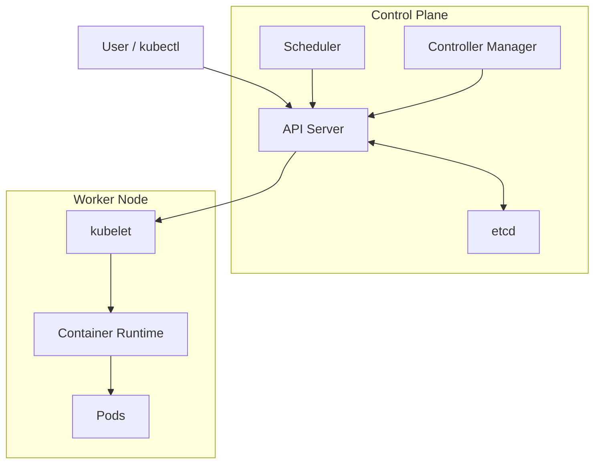
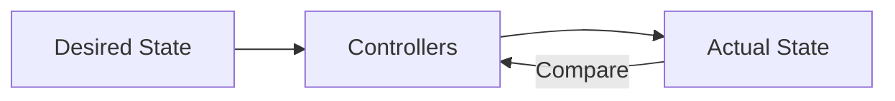

# Day 01 — Kubernetes Fundamentals 🧭

## Learning objectives

By the end of this lesson you should be able to explain what Kubernetes is, why it exists, what a cluster is, and the difference between the control plane, worker nodes, Pods, containers, and Kubernetes objects.

## What is Kubernetes?

**Kubernetes (K8s)** is an open-source platform for orchestrating containerized workloads. It automates deployment, scaling, networking, recovery, and lifecycle management.

```text
                     KUBERNETES
                          |
        +-----------------+-----------------+
        |                 |                 |
      Deploy            Scale             Heal
        |                 |                 |
     Workloads          Replicas       Failed Pods
```

## What is a cluster?

A Kubernetes cluster is a set of machines managed together.




## Control Plane

| Component | Definition |
|---|---|
| kube-apiserver | Main Kubernetes HTTP API entry point |
| etcd | Consistent key-value store containing API state |
| kube-scheduler | Selects suitable nodes for unscheduled Pods |
| kube-controller-manager | Runs control loops that reconcile state |
| cloud-controller-manager | Integrates with cloud APIs when applicable |

## Worker Node

| Component | Definition |
|---|---|
| kubelet | Node agent that manages Pods assigned to the node |
| Container runtime | Runs containers through the CRI integration |
| kube-proxy / service dataplane | Implements Service networking behavior |
| CNI plugin | Provides Pod networking |

## Pod

A **Pod is the smallest deployable unit in Kubernetes**. A Pod can contain one or more containers that share networking and storage context.

```text
Pod
├── Application container
└── Optional sidecar container
```

## Kubernetes objects

Objects are persistent API resources representing desired state.

```text
Pod → Deployment → ReplicaSet → Service
ConfigMap → Secret → Namespace
Job → CronJob → StatefulSet → DaemonSet
Ingress → PV → PVC → RBAC objects
```

## Declarative model

You describe the state you want:

```yaml
spec:
  replicas: 3
```

Kubernetes continuously works to make actual state match desired state.



## Lab — Start Minikube

```bash
minikube start
minikube status
kubectl cluster-info
kubectl get nodes -o wide
```

## Lab — Create your first Pod

Create `pod.yaml`:

```yaml
apiVersion: v1
kind: Pod
metadata:
  name: nginx-pod
spec:
  containers:
    - name: nginx
      image: nginx:latest
      ports:
        - containerPort: 80
```

Run:

```bash
kubectl apply -f pod.yaml
kubectl get pods -o wide
kubectl describe pod nginx-pod
kubectl logs nginx-pod
kubectl delete pod nginx-pod
```

## Day 1 checkpoint

You should be able to explain:

1. What Kubernetes is.
2. What a cluster is.
3. What the control plane does.
4. What a worker node does.
5. What a Pod is.
6. What etcd stores.
7. What the scheduler does.
8. What a controller does.
9. What declarative configuration means.

> Next: **Day 02 — Kubernetes Architecture Deep Dive**
