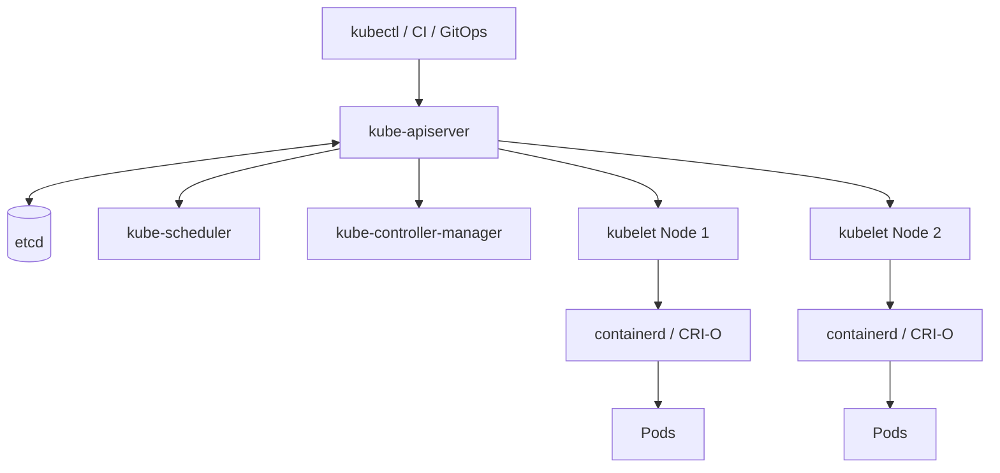

# Day 02 — Kubernetes Architecture Deep Dive 🏗️

## Objective

Understand exactly how a request travels through Kubernetes.




## Request flow — creating a Deployment

```text
kubectl
  ↓
API Server
  ↓
authentication / authorization / admission
  ↓
etcd
  ↓
controllers observe the new object
  ↓
scheduler selects a node for Pods
  ↓
kubelet receives the Pod specification
  ↓
container runtime starts containers
```

## Key definitions

- **API Server:** front door to the Kubernetes API.
- **etcd:** authoritative distributed store for Kubernetes API state.
- **Scheduler:** finds an appropriate node for an unscheduled Pod.
- **Controller:** observes desired/current state and reconciles them.
- **kubelet:** ensures assigned Pods are running and healthy.
- **Container Runtime:** starts containers through the CRI integration.

## Lab

```bash
kubectl get nodes
kubectl get pods -A
kubectl cluster-info
kubectl get --raw='/readyz?verbose'
kubectl api-resources
kubectl get pods -n kube-system
```

## Mini challenge

Explain what should happen when a Deployment asks for 3 replicas but only 2 Pods are running.

**Expected:** controllers reconcile the ReplicaSet/Deployment state, create a replacement Pod, the scheduler selects a node, and the kubelet starts it.
