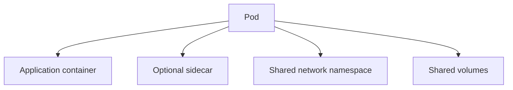

# Day 03 — Pods 🟦

## Definition

A **Pod** is Kubernetes' smallest deployable unit. It represents one or more containers that are tightly coupled and share a network namespace and volumes.



## Example

```yaml
apiVersion: v1
kind: Pod
metadata:
  name: web
  labels:
    app: web
spec:
  containers:
    - name: nginx
      image: nginx:latest
      ports:
        - containerPort: 80
```

## Lifecycle

Typical phases include `Pending`, `Running`, `Succeeded`, `Failed`, and `Unknown`.

## Labs

```bash
kubectl apply -f pod.yaml
kubectl get pod web -o wide
kubectl describe pod web
kubectl logs web
kubectl exec -it web -- sh
kubectl delete pod web
```

For multi-container Pods:

```bash
kubectl logs <pod> -c <container>
kubectl exec -it <pod> -c <container> -- sh
```

## Troubleshooting

```bash
kubectl get pod
kubectl describe pod <name>
kubectl get events --sort-by=.lastTimestamp
kubectl logs <name> --all-containers
```
